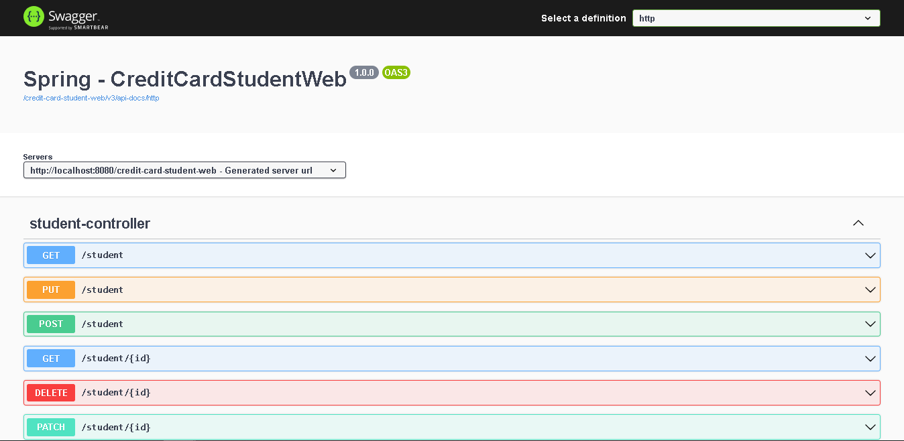

# CREDIT CARD STUDENT WEB

---
<!-- 
# OVERVIEW

---
--> 
# GRUPO

- RM346315: Lais Kagawa ([lakagawa](https://github.com/lakagawa))
- RM346511: Jônatha Lacerda Gonzaga ([jhowlacerda](https://github.com/jhowlacerda))
- RM346958: Thiago de Souza Zanella ([zanella86](https://github.com/zanella86))

---

# REPOSITÓRIOS RELACIONADOS

https://github.com/zanella86/CreditCardStudentBatch

---

# FERRAMENTAS / TECNOLOGIAS

<!-- - [Draw.io](https://app.diagrams.net/) -->
- Git / Github
- Gradle 7.6
- IntelliJ IDEA Community Edition (2022.2.1)
- MySQL Workbench 8.0 CE
- Spring Boot 3.0.4 (Java 17+)
- Swagger

---

# CONSTRUÇÃO/JUSTIFICATIVA

<u>Utilizamos o Spring Framework:</u>

- **Spring Web:** Para disponibilização dos _endpoints_ (Tomcat embutido)
- **Spring Data JPA:** Persistência via Hibernate

<u>Outros:</u>

- MySQL Driver: Para utilização do MySQL
- Lombok: Para redução da verbosidade

---

# PARA TESTAR

## Bancos de dados

### MySQL

- Crie um *database schema* no MySQL chamado `credit-card-student`

## Aplicação

### IDE

Adicione os parâmetros para conexão:

> MYSQL_USERNAME=meu_usuario;MYSQL_PASSWORD=minha-senha

### Swagger

Documentação disponível em: http://localhost:8080/credit-card-student-web/swagger-ui/index.html#/

---

# REFERÊNCIAS

- [Prof.º Fabio Tadashi - Travel](https://github.com/fabiotadashi/1SCJR-travel)
- [Spring Initializr](https://start.spring.io/;)
